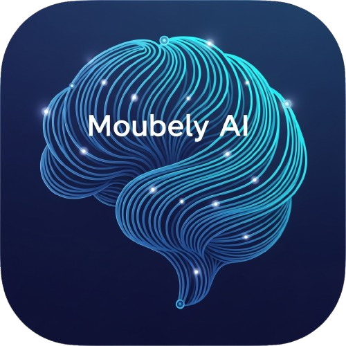

<p align="center">
  
</p>

<h1 align="center">Moubely ✨</h1>

<p align="center">
  <i>A privacy-first, always-on-top AI orchestrator for high-performance workflows</i>
</p>

<p align="center">
  
  
  
  
  
</p>

<div align="center">

[Features](#-core-features) • [Architecture](#️-system-architecture-the-resilient-controller) • [Tech Stack](#-tech-stack) • [Installation](#-installation--setup) • [Contributing](#-contributing)

> 💡 **Inspiration:** Moubely is inspired by the innovative **Cluely** app, aiming to bring similar transparent, context-aware AI capabilities to your desktop workflow.

</div>

---

## 📖 Overview

Moubely is an advanced, always-on-top AI productivity hub designed for seamless desktop integration. It provides real-time meeting assistance, high-fidelity screen analysis, and secure local-first context management in a sleek, non-intrusive interface.

### Key Highlights

- 👁️ **Privacy-Centric Workspace**: Minimized background processing with deep system tray integration
- 📸 **Visual Language Detection**: Automatically detects programming languages from screenshots (LeetCode, IDEs) or defaults to Python
- 🧠 **6-Section STAR Reasoning**: Standardized 6-part output format (Situation, Task, Action, Result, Complete Code, Post-Code Analysis)
- 📸 **Enhanced Vision Sync**: All quick actions (**Assist, Reply, Answer, Ask, Recap**) are now bridged to the vision engine
- 🧵 **Unified Chat Sessions**: Multi-turn conversations are now intelligently grouped into single history records
- ✍️ **AI Auto-Titling**: Chat sessions automatically receive 5-6 word concise titles generated by a background Gemini call
- 🎙️ **Local-First Meeting Copilot**: Privacy-first Local Whisper usage with optional Cloud redundancy
- 🕵️ **Stealth vs. Private Separation**: Decoupled screen protection (OBS hiding) from interaction (click pass-through)
- 👻 **Scroll Portal (Ghost Interaction)**: Dynamic window "solidification" using Ctrl + Hover for seamless scrolling in Private Mode
- 🏹 **Strict Arrow Mode**: Global permanent CSS cursor lock ensuring I-beams and pointers never reveal the tool's presence
- ⚖️ **Centered Conversation Architecture**: Structural UI refactor ensuring all chat, email, and history content maintains perfect visual balance with a unified max-width constraint
- 🎤 **Direct Voice Dictation**: Integrated microphone button in the chat bar for instant, low-latency speech-to-text input
- 📏 **Persistent Window Geometry**: Intelligent window state management that remembers dimensions across expand/shrink transitions without layout loops

---

## ✅ Version Comparison: What's New in v2.3?

We have shifted from a static, premium-first architecture to a universal, open-model-first engine with enhanced visual output, stealth, and a **Fluid Centered Architecture**.

| Feature | v2.2 (Old) | **v2.3 (Current)** |
| :--- | :--- | :--- |
| **Model Roster** | 18-Model Waterfall | **20+ Model Waterfall** (Llama 405B, GPT-OSS 120B) |
| **History Logic** | One record per message | **Unified Chat Sessions** (Threaded) |
| **Vision Logic** | Manual routing | **Global Vision Sync** (All actions see pixels) |
| **Privacy Engineering** | Entangled Stealth | **Decoupled Protection** (OBS hiding vs. Click Pass-through) |
| **Interaction Layer** | Manual Toggles | **Scroll Portal** (Atomic Ctrl+Hover Interaction) |
| **Layout Philosophy** | Left-Aligned Fluid | **Centered Communication Architecture** (Max-Width Unified) |
| **Input Modality** | Text-Centric | **Hybrid (Voice Dictation + Auto-Expansive Editor)** |
| **Geometry Logic** | Auto-Resize Loops | **Deterministic Persistence** (Mode-Independent Memory) |
| **Session UX** | Static date-based titles | **AI-Generated Concise Titles** (< 6 words) |
| **Truncation** | Standard overflow | **Smart line-clamp-5** with floating toggle |

---

## 🚀 Core Features

### 👁️ Privacy-Centric Workspace
Toggle instantly between **Background Mode** (system tray/minimized) and **Active Workspace** (standard window), ensuring the tool is available for high-velocity workflows but strictly non-intrusive when focus is required.

### 📸 Contextual Vision (Multi-Shot)
Instantly snap screenshots (`Ctrl + H`). Repeated presses **queue up to 12 screenshots** for multi-context analysis. Moubely "sees" your screen using a multi-model approach.

### 🧠 Resilient Multi-Provider LLM Controller
Our custom orchestration engine manages 20+ models. If one provider hits a rate limit or API error (e.g., 402 or 429), the controller automatically routes the request to the next available tier, ensuring business continuity.

### 🎙️ Hybrid Meeting Copilot
- **Local-First Transcription**: Powered by a custom **Local Whisper Server** (Tiny.en) running directly on your machine
- **Cloud Fallback**: Automatically switches to **Groq** if the local server gets too busy or if **Smart Mode** is enabled
- **Universal Digital Twin**: Uses the **STAR method** to provide spoken-word answers based on *your* specific profile data
- **Automated Workflow**: Single command (`npm start`) launches Frontend, Backend, and Local Whisper Server simultaneously

### ⚡ RAG-based Personal Knowledge Management
- **Context Grounding**: The system strictly adheres to the user's provided knowledge base (Technical Documentation, Project Notes)
- **Hallucination Reduction**: Forces the AI to ALWAYS validate answers against your provided context files (RAG), significantly reducing generic AI responses in favor of project-specific accuracy

### ⚖️ Centered Conversation Architecture
Moubely v2.3 introduces a structural refactor ensuring all chat, email, and meeting recap interfaces maintain perfect visual balance. Using a unified `max-w-3xl mx-auto` constraint, content is anchored in the user's primary focus zone, significantly improving scannability and professional aesthetic.

### 👻 Private Mode & Scroll Portal
Implemented a highly specialized **Input Passthrough** mode (`Shift + A`). While the window becomes 100% transparent to system-level clicks for underlying workflow access, our **Scroll Portal** logic allows users to "solidify" the viewport temporarily using `Ctrl + Hover` for seamless history navigation without exiting Private Mode.

### 🏹 Strict Arrow Mode (Universal Stealth)
Engineered an absolute CSS lock that forces a global `default-arrow` cursor across all DOM elements. This eliminates "pointer leakage": common visual tell-tales like I-beams over inputs that might otherwise reveal the application's presence during captured screen recordings or high-stakes screen sharing.

### 🧠 Personal Digital Twin (STAR Implementation)
Moubely doesn't just answer; it represents. By grounding responses in a user's specific `profile_data.json`, the AI adopts a professional persona that matches your unique background, leveraging the **STAR method** to ensure responses are grounded in verified user facts.

---

## 🛠️ System Architecture: The "Resilient Controller"

Moubely uses a **Smart Routing Engine** in `electron/LLMHelper.ts` that prioritizes elite reasoning models before falling back to faster or local resources.

### The "Brains" (Chat & Logic) 🧠

**New in v2.3:** We now prioritize elite, massive-parameter reasoning models (405B+) to ensure the highest possible logical accuracy before falling back to fast efficiency models.

| Tier | Models |
| :--- | :--- |
| **Tier 1: Heavy Lifters** | **Hermes 3 Llama 405B**, Llama 3.3 70B, **GPT-OSS 120B**, **Qwen 3 Next 80B**, Cosmos Nemotron 34B |
| **Tier 2: Fast Multi-Model** | **Gemma 3 Family (27B - 1B)** |
| **Tier 3: Google Performance** | Gemini 3.0 Pro, Gemini 3 Flash, Gemini 2.5 Flash, Nemotron 3 Nano |
| **Tier 4: Specialized Tiers** | **Step 3.5 Flash**, Solar Pro 3, Claude 4.5 Haiku, Claude 3.7 Sonnet (Thinking) |
| **Tier 5: Deep Safety Net** | Llama 3.2 3B, Trinity Mini, Liquid LFM 1.2B, Perplexity Sonar |

### The "Eyes" (Vision) 👁️

| Tier | Models |
| :--- | :--- |
| **Tier 1: Elite Vision** | **Gemini 3.1 Pro**, Gemini 3.0 Pro, Claude 4.5 Opus, Claude 3.7 Sonnet (Reasoning) |
| **Tier 2: Fast & Reliable** | Gemini 3 Flash, Gemini 2.5 Flash, Claude 4.5 Haiku, Mistral Small Vision |
| **Tier 3: Backups** | Mistral Large 2 (Nvidia), GPT-4o, Perplexity Vision |

### The "Ears" (Audio) 👂

| Type | Description |
| :--- | :--- |
| **Local Whisper** | Primary. Uses `Xenova/whisper-tiny.en` running locally on port 3000 |
| **Groq (Whisper-Large-V3)** | Instant cloud fallback if the local queue times out or fails |

---

## 🐛 Solved Engineering Challenges

<details>
<summary><strong>1. The Missing "Post-Code Analysis" (Prompt Routing)</strong></summary>

**Problem:** The AI was reliably generating code but skipping the crucial final analysis step for image-based submissions because the "Solve" system prompt was never actually being sent to the vision endpoint.

**Solution:** Updated the IPC pipeline and `LLMHelper.ts` to explicitly route a `type='solve'` parameter for screenshot-based coding problems, mapping it to a strict 6-section STAR prompt.
</details>

<details>
<summary><strong>2. Markdown Rendering vs. Raw HTML Tags</strong></summary>

**Problem:** Strict prompt instructions to output `<mark>` tags for yellow highlighting were being neutralized by React Markdown's secure sanitization, resulting in literal, unstyled HTML tags appearing on the UI.

**Solution:** Built a **Custom Render Interceptor** in `AIResponse.tsx` that intercepts the standard Markdown AST (Abstract Syntax Tree). It identifies specific target phrases (e.g., `**Say:**`, `**Type:**`, `**Situation:**`) at the DOM generation level and dynamically wraps them in custom Tailwind background utility classes (`bg-yellow-500/20`). This preserves strict XSS security while achieving native, color-coded aesthetic highlighting across all models.
</details>

<details>
<summary><strong>3. The "Python First" Monolingual Myth</strong></summary>

**Problem:** By defaulting all output to Python, users submitting Java, C++, or TypeScript screenshots experienced high friction having to manually translate the solution.

**Solution:** Implemented **Visual Context Language Detection**. The vision prompt now instructs the model to scan the UI (e.g., dropdowns, syntax structures) in the provided screenshot to automatically infer the target language, falling back to Python only when fully ambiguous.
</details>

<details>
<summary><strong>4. The "First Message" API Crash (Gemini/Perplexity)</strong></summary>

**Problem:** Gemini 3.0 and Perplexity APIs strictly require the first message in the chat history to be from the `user`. Our app sometimes started history with an AI greeting (`role: model`), causing 100% failure rates.

**Solution:** Implemented **History Sanitization** in `LLMHelper.ts`. Before sending any request, the code scans the history array, finds the index of the first `user` message, and slices everything before it.
</details>

<details>
<summary><strong>5. The "Blind" Solve Button</strong></summary>

**Problem:** The "Solve" button was blindly sending requests to the `gemini-chat` (Text) endpoint, even when screenshots were attached.

**Solution:** Implemented **Split Routing** in `Queue.tsx`. The function now checks `if (hasImages)` and routes to the correct endpoint.
</details>

<details>
<summary><strong>6. The "Single-Message" History Trap</strong></summary>

**Problem:** Every single user interaction created a new, isolated entry in the History database, making it impossible to follow a multi-turn conversation or reload context.

**Solution:** Refactored the storage schema to use `ChatSession` objects. The system now checks for `loadedSessionId`; if active, new messages are appended to an array within a single record, enabling full threaded history restoration.
</details>

<details>
<summary><strong>7. Global Vision Sync (Bridging Action Gaps)</strong></summary>

**Problem:** Vision support was hardcoded exclusively for the "Solve" button. Quick actions like "Assist" or "Ask" ignored the screenshot queue, forcing users to manually double-prompt.

**Solution:** Generalized the `triggerAssistAction` pipeline. It now dynamically checks the screenshot buffer; if occupied, it automatically switches the IPC call from `gemini-chat` to `chat-with-image`, injecting the prompt with visual context.
</details>

<details>
<summary><strong>8. The "Stealth Leakage" (Native Tooltips)</strong></summary>

**Problem:** Despite a "stealth" UI, native browser/Electron `title` attributes would trigger OS-level tooltips on hover, which are captured by screen recording software and reveal the tool's presence.

**Solution:** Conducted a global audit to purge the `title` attribute from the entire DOM. Replaced critical feedback with custom, non-native floating elements and micro-animations that stay within the app's coordinate space.
</details>

<details>
<summary><strong>9. AI-Powered Session Titling</strong></summary>

**Problem:** Date-based history titles are non-descriptive, requiring users to open every session to find specific information.

**Solution:** Implemented a background "Title Generator" hook. Upon sending the first message of a new session, an invisible sub-request is sent to Gemini to distill the user's intent into a 5-6 word title.
</details>

<details>
<summary><strong>10. The Truncation UX Paradox</strong></summary>

**Problem:** Long prompts cluttered the chat bubble, but simple `overflow: hidden` made copy-pasting impossible.

**Solution:** Engineered a `<CollapsibleUserMessage />` component using Tailwind's `line-clamp-5`. It preserves whitespace formatting exactly as typed while providing a floating chevron toggle for expansion.
</details>

<details>
<summary><strong>11. Advanced Window Layering (UX)</strong></summary>

**Problem:** Standard Electron windows capture mouse events even when entirely transparent, creating "ghost bounds" that interfere with underlying desktop applications and block clicks.

**Solution:** Engineered a robust DWM (Desktop Window Manager) hit-test workaround leveraging explicit `setBounds` recalculations paired with synchronized opacity flutters (`win.setOpacity`). Combined with dynamic `win.setIgnoreMouseEvents` fallback handlers, this guarantees a zero-latency seamless cross-application experience.
</details>

<details>
<summary><strong>12. The Transcript "Race Condition"</strong></summary>

**Problem:** Groq (Cloud) processed faster than Local Whisper, causing transcripts to appear out of order.

**Solution:** Implemented a **Ticket System** with timestamps to ensure perfect chronological order.
</details>

<details>
<summary><strong>13. Consolidating Context Consistency</strong></summary>

**Problem:** Large Language Models often drift into generic or hallucinated answers when asked specific domain questions.

**Solution:** Added a **"Pivot Rule" RAG Layer** that forces the model to ground its answers in the provided knowledge base files.
</details>

<details>
<summary><strong>14. The Ghost Window (Critical Visibility Crash)</strong></summary>

**Problem:** The app would start with no window visible at all due to Electron transparency bugs.

**Solution:** Implemented an aggressive `ready-to-show` callback with explicit `win.focus()`.
</details>

<details>
<summary><strong>15. The "Silent Crash" (Circular Dependency)</strong></summary>

**Problem:** The app would hang on startup because `Main` and `IPC Handlers` were importing each other.

**Solution:** Refactored the architecture to use **Type-Only Imports** (`import type`).
</details>

<details>
<summary><strong>16. "Thinking" Process Clean-Up</strong></summary>

**Problem:** Reasoning models output their internal monologue (`<think>...`), cluttering the chat.

**Solution:** Implemented a **Universal Response Cleaner** to filter out thought tags in real-time.
</details>

<details>
<summary><strong>17. Addressing "Context Drift"</strong></summary>

**Problem:** Models would ignore "soft" instructions to use specific formatting and revert to standard outputs.

**Solution:** Injected **5 Contextual Anchors** (Tone, References, Format) directly into the `systemContext` block, making them strictly adhered to by the model.
</details>

<details>
<summary><strong>18. "Smart Mode" Latency & Sync</strong></summary>

**Problem:** Fixed 2.5s chunks were too short for context, and 10s chunks were too slow for conversation.

**Solution:** Implemented **Variance-Based Silence Detection**. The app analyzes the audio waveform; if it detects silence >3s, it forces an early transcription.
</details>

<details>
<summary><strong>19. The "Hardcoded" Prompt Myth</strong></summary>

**Problem:** The prompts appeared static, limiting the app to one user.

**Solution:** Architecture refactor to use **Dynamic Profile Loading**. The prompt in code is just a template; the content is loaded from `user_profile.json` at runtime.
</details>

<details>
<summary><strong>20. The Output Formatting Fade</strong></summary>

**Problem:** Smaller models often ignore "soft" instructions to use specific markdown bolding for scannability, leading to plain, "blank-looking" answers.

**Solution:** Implemented a **Regex-Based Auto-Highlighter** fallback. The system now post-processes every response, automatically wrapping project keywords, technical terms, and percentage values in `**` if the model fails to do so.
</details>

<details>
<summary><strong>21. Startup "Ghosting" vs. Visibility</strong></summary>

**Problem:** To prioritize stealth, the app used to boot invisibly, which often led users to believe the application had failed to launch.

**Solution:** Inverted the initial boot logic. Moubely now spawns in a **Visible State** by default, allowing the user to confirm system readiness before manually toggling into **Stealth Mode** using the integrated hotkey.
</details>

<details>
<summary><strong>22. Visual Convergence: The Centering Paradox</strong></summary>

**Problem:** Centering content in an Electron window using standard CSS (`mx-auto`) creates large empty logical hitboxes flanking the content. These invisible areas would block clicks directed at underlying apps.

**Solution:** Engineered a **Dynamic Interactive Layering System**. We decoupled visual alignment from the interaction handler. By precisely calculating viewport bounds and dynamically updating Electron's `setIgnoreMouseEvents` specifically for the X-axis margins, we ensured the app feels visually balanced while physically remaining non-blocking.
</details>

<details>
<summary><strong>23. Atomic Async Input Injection</strong></summary>

**Problem:** Injecting transcribed text into an active React `textarea` often causes state overwrites where user typing and async transcription collide, leading to cursor jumps.

**Solution:** Implemented a **Synchronized State Buffer Manager**. The dictation handler takes an atomic snapshot of current input upon microphone closure, performs a clean string append, and forces a cursor refocus event to the end of the new string.
</details>

<details>
<summary><strong>24. Deterministic Geometry vs. OS Feedback Loops</strong></summary>

**Problem:** Standard Electron windows trigger recursive resize events when switching between "Expanded" and "Shrink" modes, as the OS layout engine and the App disagree on final bounds.

**Solution:** Built a **Hard-Boundary Controller** in `WindowHelper.ts`. It utilizes isolated memory states. Instead of listening to resize events, it forcefully overrides boundaries during transitions using `setMinimumSize` and `setMaximumSize` locks at the process level.
</details>

<details>
<summary><strong>25. The "Ghost Interaction" Physics (Scroll Portal)</strong></summary>

**Problem:** True ghost windows (click-through) are physically unreachable for scrolling history.

**Solution:** Developed a **Modifier-Driven Hit-Test Override**. By leveraging Electron's `forward` flag with `setIgnoreMouseEvents`, we tracked mouse coordinates in a transparent state. Combining this with a low-level listener for the `Ctrl` key allowed us to "solidify" the interaction target only on-demand.
</details>

<details>
<summary><strong>26. Auto-Scaling Dynamic Prompt Editor</strong></summary>

**Problem:** A fixed-height edit input is either too large for simple fixes or too small for thorough prompt revisions.

**Solution:** Built a **Ref-based Auto-Resizer**. The edit textarea starts at a single line (40px). As text is added, it dynamically recalculates `scrollHeight` and expands the UI container up to a 120px limit before transitioning into a scroll view.
</details>

---

## 📦 Installation & Setup

### Prerequisites

- Node.js v18 or higher
- npm or yarn
- Git

### 1. Clone the Repository

```bash
git clone https://github.com/Moubarak-01/Moubely.git
cd Moubely
```

### 2. Install Dependencies

```bash
npm install
```

### 3. Environment Configuration

### Required API Keys

| Service | Variable Name | Get Key Here |
| :--- | :--- | :--- |
| **Google Gemini** | `GEMINI_API_KEY` | [Get Key](https://aistudio.google.com/app/apikey) |
| **GitHub** | `GITHUB_TOKEN` | [Get Token](https://github.com/settings/tokens) |
| **Groq** | `GROQ_API_KEY` | [Get Key](https://console.groq.com/keys) |
| **Perplexity** | `PERPLEXITY_API_KEY` | [Get Key](https://www.perplexity.ai/settings/api) |
| **OpenRouter** | `OPENROUTER_API_KEY` | [Get Key](https://openrouter.ai/keys) |
| **NVIDIA NIM** | `NVIDIA_API_KEY` | [Get Key](https://build.nvidia.com) |
| **OCR Space** | `OCR_SPACE_API_KEY` | [Get Key](https://ocr.space/ocrapi) |

Create a `.env` file in the root directory and paste the following:

```env
# 1. THE BRAINS & EYES (Primary Chat + Vision)
GEMINI_API_KEY=your_key_here

# 2. THE LOGIC & BACKUP (DeepSeek + GPT-4o)
GITHUB_TOKEN=your_token_here

# 3. THE CLOUD EARS (Audio Backup)
GROQ_API_KEY=your_key_here

# 4. THE RESEARCHER & REASONER (Search + Claude)
PERPLEXITY_API_KEY=your_key_here
OPENROUTER_API_KEY=your_key_here

# 5. NVIDIA NIM (New Tier 1)
NVIDIA_API_KEY=your_key_here

# 6. PDF RECOVERY (Scanned Docs)
OCR_SPACE_API_KEY=your_key_here
```

### 4. Start the Application

```bash
npm start
```
*This command automatically launches the Vite Dev Server, Electron Backend, and Local Whisper Server.*

---

## 📂 Project Structure

```
Moubely/
├── package.json
├── .env                        # Contains API Keys
├── local-whisper-server.mjs    # Local AI Audio Engine
│
├── electron/
│   ├── main.ts                 # App Entry Point
│   ├── WindowHelper.ts         # Stealth, Geometry & Persistence Logic
│   ├── LLMHelper.ts            # The "Waterfall" Logic & Smart Router
│   ├── ProcessingHelper.ts     # Automation Workflow
│   └── ipcHandlers.ts          # Logs & Communication
│
├── src/
│   ├── App.tsx                 # Main UI Entry
│   ├── _pages/
│   │   ├── Queue.tsx           # Main Chat Interface (Streaming Logic)
│   │   └── ProfileSettings.tsx # Universal Story Editor
│   ├── components/
│   │   └── AIResponse.tsx      # Markdown & LaTeX Rendering Logic
│   └── index.css               # Glassmorphism Styles
│
└── index.html
```

---

## 🤝 Contributing

1. Fork the repository
2. Create a feature branch (`git checkout -b feature/amazing-feature`)
3. Commit your changes (`git commit -m 'Add amazing feature'`)
4. Push to the branch (`git push origin feature/amazing-feature`)
5. Open a Pull Request

---

## 📄 License

This project is licensed under the **MIT License**.

### 🛡️ Mandatory Attribution

If you clone, fork, or use any logic from this repository (especially the **Resilient Controller** or **Window Management Systems**), you are **legally required** to:
- Retain the original copyright notice in the `LICENSE` file
- Provide a visible link back to this [Moubely Repository](https://github.com/Moubarak-01/Moubely)
- Acknowledge **Moubarak-01** as the original author

---

## 👨‍💻 Author

**Moubarak**
- GitHub: [@Moubarak-01](https://github.com/Moubarak-01)

---

Made with ❤️ for seamless desktop productivity

**Moubely: Your Invisible AI Companion**
